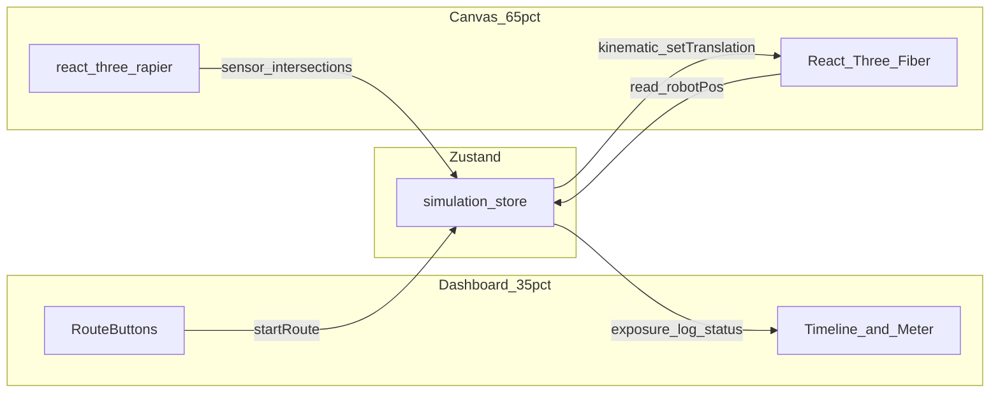

# Fleet AI — Nuclear Decommissioning World Pack (Vite + R3F) Demo

## Stack and project bootstrap

- Create the app in the repo root (or a subfolder if you prefer later) with **Vite (React + TypeScript)** and **strict** TS.
- Add dependencies: `@react-three/fiber`, `@react-three/drei`, `three`, `@react-three/rapier`, `zustand`, `tailwindcss` + Vite plugin (`@tailwindcss/vite` for Tailwind v4, or the classic `tailwind.config` + PostCSS v3 if you need broader ecosystem compatibility on day one), `class-variance-authority` optional for button variants.
- **Entry point**: `main.tsx` → `App.tsx` wiring a two-column layout; wrap the right pane in a fixed-height `Canvas` container (e.g. `h-[100dvh]`) and set `antialias`, `shadows` if you use a simple directional light.

## Layout shell (35% / 65%)

- Use a **root flex or CSS grid** on `min-h-screen` with:
  - **Left** `w-[35%] min-w-[280px]` (stack panels with `overflow-y-auto`, `border-r`, dark background).
  - **Right** `flex-1` or `w-[65%] relative` for the 3D view (full height).
- **Tailwind theme** (in `index.css` / theme): base `bg-slate-950` / `text-slate-100`, borders `slate-800`, accents **cyan-400/500** (HUD), **amber-500** (radiation), monospace for telemetry (`font-mono` on data rows).
- **Responsive note**: for narrow screens, stack with `flex-col` and give the canvas a minimum height (`min-h-[50vh]`) so the demo still works on a laptop at the event.

## Zustand simulation store (single source of truth)

Add something like `src/simulation/store.ts` and optional `src/simulation/types.ts`:

- **State**: `robotPos` (THREE.Vector3 or `{x,y,z}`), `exposure` (number), `routeId` / `activeRoute` (`'idle' | 'safe' | 'risky' | 'failed'`), `waypointIndex`, `isAnimating`, `log` (append-only array of trace entries), `verifier` (`null` | `{ passed, reasons[] }`), `mission` title/copy.
- **Each log entry** matches your spec: `state`, `action`, `nextState`, `timestamp` (ISO or `performance.now()` offset from run start for deterministic replays), `verifier` snapshot or `"pending"`.
- **Actions**: `startRoute(kind)`, `tick` / internal step completion, `appendLog`, `reset`, `setExposure`, `runVerifier()`.
- **Route data**: `src/simulation/routes.ts` exporting three static arrays of **waypoints** (as plain `{x,y,z}[]` or `Vector3` clones) and optional per-route metadata (label, “expected” outcome for the “failed” demo). Keep routes data-driven so the timeline and 3D stay in sync.

No persistence layer required; **Export JSON** = `JSON.stringify` of `{ mission, log, finalExposure, verifier, exportedAt }`.

## 3D scene architecture (R3F + Rapier + Drei)

- **`WorldPackScene.tsx`**: `Physics` (from `@react-three/rapier` with `gravity={[0,0,0]}`) containing static environment colliders and the **robot** `RigidBody` type **`kinematicPosition`** (you drive position each frame; avoids fighting dynamic physics during scripted paths).
- **Environment (primitives only)**:
  - **Reactor hall**: large `box` floor + a few `box` walls; **corridors** as offset boxes forming L-shaped or grid passages.
  - **Pipes**: `cylinder` primitives along edges or as crossed segments.
  - **Barrels / debris**: `cylinder` + `box` clusters, non-interactive static bodies for visual + future collision.
  - **Safe zone**: translucent `mesh` (low opacity `meshStandardMaterial`) or a `box` with `emissive` green-tint, optional sensor collider for “entered safe zone” logs.
  - **V-17 valve**: a **torus** + `cylinder` stem; position fixed; a **Drei** `<Text>` or `<Html center>` label **“V-17”** ~1m above.
  - **Robot avatar**: `group` of `capsuleGeometry` or `box`+`cylinder` “chassis” + small directional marker so orientation reads on camera.
- **Rapier radiation zones**: use **`Collider`** with **`sensor`** on one or more `box` (or `ball`) regions representing contaminated areas. In `@react-three/rapier`, subscribe to **intersection events** (`onIntersectionEnter` / `onIntersectionExit` on the robot’s `RigidBody` or child collider) to flip a “inZone” boolean in the store, or to accumulate exposure in the animation loop.
- **Exposure model** (simple and demo-friendly): in `useFrame` or a small `useEffect` interval during animation, if `inRadiationZone`, `exposure += rate * delta`; optionally add a per-route multiplier for the “failed” run.
- **Drei**:
  - `OrbitControls` (damped) with `makeDefault` and limited polar angle if you want a consistent “tour” feel, or `PerspectiveCamera` + `PointerLockControls` only if you explicitly want first-person (orbit is safer for a booth demo).
  - **`Line`** or **`useTrail`** optional for a faint path preview; not required for MVP.
  - **Labels**: `<Text>` (billboard) or `<Html pointerEvents="none">` for: reactor hall, valve V-17, two radiation zones, safe zone, and robot call sign.

## Route animation and logging pipeline

- Implement **`useRoutePlayer`** (or logic inside a small `SimulationController` component) that:
  1. On `Run * Route`, `reset` / seed state, then iterate **waypoint index**.
  2. Each segment: lerp / `slerp` the kinematic `RigidBody` translation toward the next waypoint over a fixed **duration** (e.g. 0.8–1.2s) using `useFrame` + elapsed time, or a minimal tween helper.
  3. On each **waypoint start** and **waypoint end**, `appendLog` with stable `state` / `action` / `next_state` strings (e.g. `NAV:corridor_2` → `ACTION:move` → `NAV:valve_approach`).
- **Three route personalities** (content-level, not new systems):
  - **Safe**: stays in corridor mesh, short exposure ticks.
  - **Risky**: path intersects one or more radiation sensor volumes for longer.
  - **Failed**: e.g. exposure exceeds threshold, or waypoints end without proximity to V-17 (set verifier inputs accordingly).

## Verifier and dashboard panels

- **`verifier.ts`**: pure functions, e.g. `checkMission({ exposure, atValve, inSafeZone, route })` returning `{ pass, details[] }`. Call once when the last waypoint completes (or when a “failed” route intentionally aborts early on a `fail` state).
- **Left dashboard sections** (components under `src/ui/`):
  - `MissionPanel`, `RobotStatus` (pos, in-zone, route name), `TaskChecklist` (driven from static mission + dynamic checked steps), `RadiationMeter` (linear or segmented bar, color ramp green → amber → red), `VerifierPanel`, `TrajectoryTimeline` (map `log` to a vertical or horizontal list; show timestamp + one-line summary), `ExportButton` (blob download `mission-export.json`).

## Visual polish (clean / dark / technical)

- Tight `gap-4` grid, `uppercase tracking-wide` section titles, `text-xs` meta lines.
- 3D: one **key + fill** light, subtle fog (`Fog` in R3F or `color`+`fog` on scene), `meshStandardMaterial` with low roughness on metal, **emissive** for HUD-like strips on floor.
- **Performance**: `dpr` clamp `[1, 1.5]`, `frameloop="always"` or `"demand"`; keep primitive counts low.

## File structure (suggested)

- `src/App.tsx` — layout
- `src/three/WorldPackScene.tsx`, `src/three/Robot.tsx`, `src/three/EnvironmentPrimitives.tsx`, `src/three/RadiationSensors.tsx`
- `src/simulation/store.ts`, `routes.ts`, `verifier.ts`, `useRoutePlayer.ts` (or merge into a hook)
- `src/ui/*` — dashboard components
- `index.css` — Tailwind + a few custom CSS variables for the theme

## Testing the demo (manual)

- One **npm run build** to ensure no TS/three type conflicts.
- Click each route: robot moves, exposure changes in radiation volumes, log grows, timeline updates, final verifier and export match expectations.

